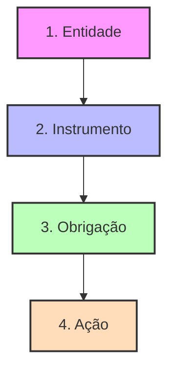

# 📖 Manual do Usuário - Sistema AGEMS

Bem-vindo ao manual de uso do **Sistema de Gestão Regulatória da AGEMS**. Este documento foi criado para orientar você na utilização das principais funcionalidades da plataforma.

---

## 1. Visão Geral e Acesso

### 🔐 Acesso ao Sistema
Para acessar o sistema, utilize o navegador de sua preferência e insira o endereço fornecido pela equipe de TI (ex: `http://localhost:8000`).

1. **Login:** Insira seu nome de usuário e senha.
2. **Primeiro Acesso:** Caso seja seu primeiro acesso com uma senha temporária, o sistema solicitará que você defina uma nova senha segura.
3. **Dashboard:** Após o login, você será direcionado ao Painel Principal, que apresenta um resumo gráfico das ações e status das obrigações.

### 👥 Perfis de Acesso
O que você pode fazer no sistema depende do seu perfil (o sistema possui 6 perfis funcionais organizados em 4 níveis de grupos Django):
- **Admin do Sistema** (0): Acesso total e irrestrito, inclusive a logs e configurações técnicas globais no `/admin`.
- **Gestor (Diretor/Assessor)** (1 e 2): Gerenciamento completo de Entidades, Instrumentos, Obrigações e Ações (pode criar, editar e excluir). Possui dashboard global.
- **Técnico (Coordenador/Executor)** (3 e 4): Foco operacional. Pode criar e editar **Ações**, anexar fotos/evidências, preencher checklists, mas **não pode excluir**. Tem visibilidade restrita a ações onde é participante.
- **Visualizador (Auditor)** (5): Acesso para auditoria e consulta geral em modo de somente leitura. Não vê botões de ação ou formulários editáveis.

---

## � O que é cada item no processo?

Para entender como o sistema funciona, é fundamental conhecer os conceitos principais da regulação:

### 🏢 1. Entidade
A **Entidade** é o centro de tudo. Representa a empresa, órgão ou concessionária que presta um serviço regulado ou possui uma relação jurídica com a AGEMS.
- **Exemplos de tipos:** Concessionária, Órgão Público, Prefeitura, Permissionária.
- **Tipos de Serviço:** Saneamento, Energia, Gás, Transportes, etc.

### 📜 2. Instrumento
O **Instrumento** é o documento jurídico (o "vínculo") entre a AGEMS e a Entidade. Ele define as regras do jogo.
- **Exemplos de tipos:** Contrato de Concessão, Convênio, Acordo de Cooperação, Termo Aditivo.
- **Identificação:** Cada instrumento possui um **NUP (E-MS)**, que é o número do processo oficial no Estado.

### 📝 3. Obrigação
As **Obrigações** são as cláusulas ou compromissos específicos contidos em um Instrumento que a Entidade deve cumprir.
- **Exemplos:** Envio de relatório mensal, meta de cobertura de esgoto, manutenção de frota, pagamento de taxas.
- **Prazo:** Toda obrigação tem um prazo (vencimento) e um status de cumprimento.

### ⚡ 4. Ação
A **Ação** é a atividade prática realizada pela equipe da AGEMS para verificar o cumprimento de uma obrigação ou realizar um projeto.
- **Exemplos de tipos:** Fiscalização de Campo, Análise Técnica, Vistoria, Averiguação de Denúncia.
- **Vínculo:** Uma Ação nunca está "solta"; ela sempre atesta ou verifica uma **Obrigação** específica de um **Instrumento**.

---

## �🚀 Fluxo Operacional Recomendado

Para que o sistema funcione corretamente e os dados fiquem vinculados, siga esta sequência de cadastro:

1.  **Entidade:** Primeiro, cadastre a empresa ou concessionária. Nada pode ser feito sem uma entidade de base.
2.  **Instrumento:** Com a entidade cadastrada, crie o Instrumento (Contrato/Convênio) vinculado a ela.
3.  **Obrigação:** Dentro do Instrumento, liste as obrigações contratuais que devem ser monitoradas.
4.  **Ação:** Por fim, crie as Ações (fiscalizações/vistorias). Note que cada Ação deve estar vinculada a uma **Obrigação** de um **Instrumento** específico.

---

## 2. Gestão de Entidades Reguladas

O módulo de **Entidades** é onde você gerencia as empresas e órgãos sob regulação da AGEMS (ex: Concessionárias de saneamento, energia, etc).

### ➕ Cadastrar uma Entidade
1. No menu lateral, clique em **Entidades**.
2. Clique no botão **+ Nova Entidade**.
3. Preencha os dados básicos (Nome, CNPJ, Tipo de Entidade, Informações de Contato).
4. Clique em **Salvar**.

### 🔍 Consultar e Editar
- Na listagem de entidades, utilize a barra de busca para encontrar uma empresa específica.
- Clique no ícone de **lápis (editar)** para atualizar informações.
- Se você for **Gestor**, verá também a opção de **Excluir**.

---

## 3. Instrumentos Jurídicos e Contratos

**Instrumentos** são os documentos que regem a relação com as entidades (Contratos de Concessão, Convênios, Aditivos).

### ➕ Cadastrar um Instrumento
1. Acesse o menu **Instrumentos**.
2. Clique em **+ Novo Instrumento**.
3. Selecione a **Entidade** vinculada, o **Tipo de Instrumento** e informe o número do processo (NUP/E-MS).
4. **Arquivos:** Você pode anexar o PDF do contrato ou outros documentos relevantes diretamente na tela de cadastro/edição.

### 📋 Gestão de Obrigações
Dentro de cada instrumento, você encontrará a lista de **Obrigações**.
- **% Atendimento:** O Gestor pode atualizar manualmente o percentual de cumprimento de cada obrigação (0 a 100%).
- **Status:** O sistema indica se a obrigação está `Vencida`, `Cumprida` ou `Em Andamento`. Você pode sobrescrever esse status se necessário.

---

## 4. Operação de Ações (Fiscalizações e Projetos)

O módulo de **Ações** é o coração da execução do sistema. Ele é usado para registrar fiscalizações, análises técnicas e outras tarefas.

### 🛠️ Criar e Gerenciar Ações
1. Vá em **Ações** -> **+ Criar Ação**.
2. **Vínculo:** Selecione o **Instrumento** e a **Obrigação** específica que motiva esta ação.
3. **Equipe:** Defina um **Responsável** e adicione **Executores** (colaboradores).
4. **Descrição e Status:** Descreva o que será feito e defina o status inicial (Pendente, Em Execução, etc).

### 🗺️ Formas de Visualização
- **Listagem:** Visão de tabela tradicional com filtros avançados.
- **Kanban:** Visualize suas ações em cartões organizados por colunas de status. Você pode arrastar os cartões para mudar o status rapidamente.
- **Calendário:** Veja os prazos em uma visão mensal ou semanal.

---

## 5. Recursos Adicionais

### 🗺️ Georreferenciamento e Mapas
- Acesse o módulo de **Mapas** para visualizar as entidades e ocorrências geograficamente.
- O sistema permite o upload de arquivos **KML** para sobrepor camadas de dados no mapa.

### 📈 Indicadores e Conformidade
- O menu **Indicadores** permite acompanhar metas contratuais e valores ideais definidos para cada serviço regulado.

### 📸 Fotos e GPS
- Ao realizar ações de campo, você pode anexar fotos diretamente. O sistema registrará automaticamente as coordenadas de **GPS** da foto (extraídas dos metadados EXIF) para fins de comprovação e auditoria.

### 🔔 Alertas e Notificações
- O sistema possui um motor de notificações para alertar sobre ações atrasadas, novas tarefas atribuídas e prazos de obrigações.
- As notificações são exibidas no painel (sininho) e podem ser enviadas por e-mail de forma imediata ou em resumos diários/semanais.
- Ajuste suas preferências de alerta no menu de perfil em **Configurações de Notificação**.

### 📊 Inteligência e Integração de Dados
- Exclusivo para perfis com permissão especial (*Dataset Manager*).
- Permite configurar a conexão com APIs externas, bancos de dados SQL, planilhas e arquivos CSV.
- Permite processar cargas de dados históricas (Snapshots), estruturar conjuntos de dados tabulares (Datasets) e criar Widgets gráficos personalizados.
- É possível criar vínculos regulatórios entre datasets e as obrigações para auditorias automáticas.

---

> [!TIP]
> **Esqueceu a senha?** Entre em contato com o administrador do sistema para realizar o reset do seu acesso.
